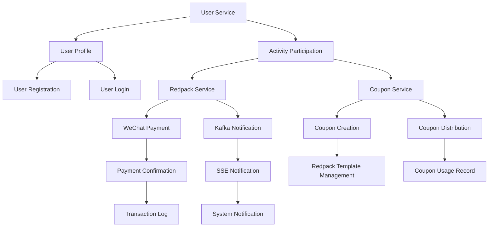

 ### 架构总览

#### 服务划分与技术选型
- **微服务划分**:
  - `user-service`: 用户管理，包括用户注册、登录、信息查询等。
  - `coupon-service`: 优惠券管理，包括优惠券创建、发放、使用记录等。
  - `redpack-service`: 红包管理，包括红包创建、发放、领取记录等。
  - `payment-service`: 支付处理，包括微信支付、异步通知处理等。
  - `notification-service`: 实时通知服务，包括用户通知、系统通知等。

- **技术选型**:
  - **框架**: Spring Boot
  - **ORM**: MyBatis Plus
  - **数据库**: MySQL 8.0+
  - **认证与授权**: JWT, RBAC
  - **消息队列**: Kafka（用于异步优惠券发放）
  - **实时通知**: SSE

### 服务职责划分

- **user-service**:
  - 用户注册、登录、信息查询
  - 用户活动参与记录

- **coupon-service**:
  - 优惠券创建、发放、使用记录管理
  - 优惠券模板管理

- **redpack-service**:
  - 红包创建、发放、领取记录管理
  - 红包模板管理

- **payment-service**:
  - 微信支付处理
  - 异步通知处理

- **notification-service**:
  - 用户通知发送
  - 系统通知广播

### 服务间通信方式

- **同步调用**: 对于用户活动参与记录，使用 REST API 进行同步调用。
- **异步调用**: 对于优惠券发放和红包领取记录，使用 Kafka 进行异步消息传递。

### 数据一致性方案

- **本地事务**: 使用 Spring 的声明式事务管理，确保单个服务内部的数据一致性。
- **分布式事务**: 对于跨服务的操作（如用户参与活动、优惠券发放），使用两阶段提交或 Saga 模式进行分布式事务管理。
- **消息队列**: 通过 Kafka 确保异步操作的可靠性和顺序性。

### 高可用和容灾设计

- **负载均衡**: 使用 Nginx 或 Spring Cloud Gateway 进行负载均衡，确保服务高可用。
- **数据库主从复制**: MySQL 主从复制，提高读写分离和数据冗余。
- **Kafka 集群**: Kafka 集群部署，确保消息队列的高可用性和容灾能力。
- **熔断降级**: 使用 Hystrix 或 Resilience4j 进行服务熔断和降级。

### 技术栈推荐

- **Java**: 用于后端开发
- **Spring Boot**: 微服务框架
- **MyBatis Plus**: ORM 框架
- **MySQL 8.0+**: 数据库
- **Kafka**: 消息队列
- **JWT**: 认证机制
- **SSE**: 实时通知
- **Nginx 或 Spring Cloud Gateway**: 负载均衡

### Mermaid 架构图

### 总结

通过上述架构设计，我们确保了系统的高并发、库存控制和系统稳定性。每个微服务都有明确的职责划分，并通过异步通信和分布式事务管理确保数据一致性。负载均衡和容灾设计进一步提高了系统的可用性和可靠性。